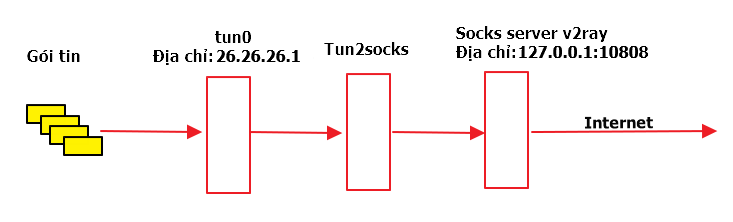
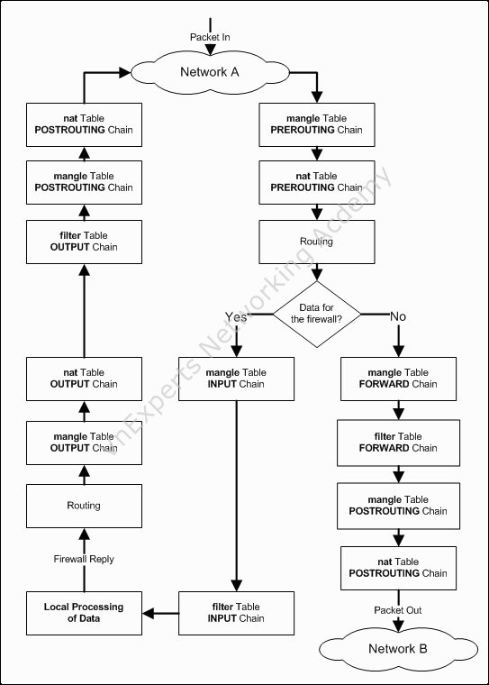

# VPN và câu chuyện phát wifi

### Tổng quan
Đôi khi tôi hay dùng 4G và v2rayNG để tạo vpn truy cập mạng tránh kiểm duyệt, dùng trên điện thoại android cùi bắp của tôi thì vẫn tốt không vấn đề gì nhưng, khi tôi muốn chia sẻ wifi cho điện thoại hoặc máy tính khác thì 1 là không vào được mạng, 2 là không đúng cái mạng vpn đã tạo mà là mạng 4G. Hơn nữa muốn truy cập đúng cái vpn đã tạo thì phải thiết đặt http/socks5 proxy các kiểu trên các máy khác, điều này làm tôi khó chịu nên tôi đã điều tra, phân tích nguyên nhân. Sau đây là bài phân tích đó.
### Các thông tin cơ bản.
#### Ứng dụng v2rayNG
Ứng dụng này có 2 thành phần quan trọng sau đó là [tun2socks](https://github.com/xjasonlyu/tun2socks) và v2ray core.

**Tun2socks** là một ứng dụng đóng/mở gói và chuyển tiếp gói tin đến các proxy như HTTP/Socks4/Socks5/Shadowsocks. Hoạt động tại lớp mạng như là một gateway (cổng mạng).

**V2ray** là một ứng dụng proxy. Hay được dùng để vượt tường lửa bên tàu.

Theo mặc định v2ray sẽ tạo socks5 server tại: **0.0.0.0:10808** và http server tại: **0.0.0.0:10809** trên điện thoại khi ứng dụng bắt đầu chạy.

#### Cách vận hành v2rayNG
Cơ bản v2rayNG sẽ yêu cầu hệ hiều hành android tạo cho nó một card mạng tên là **tun0** địa chỉ mặc định là **26.26.26.1**. Sau đó mọi gói tin đi đến card tun0 được chuyển tiếp đến Tun2socks, và Tun2socks lại gửi gói tin đến địa chỉ 1 địa chỉ socks5 server do v2ray tạo ra. V2ray tiếp tục mang gói tin đã đóng gói này ra thế giới internet đến v2ray server trên vps, gói tin được chuyển về dạng ban đầu và được gửi đến server đích.
 


Mọi thứ vẫn ổn khi bạn chạy bất kì ứng dụng nào trên chiếc điện thoại này. Nhưng khí bạn phát wifi thì gói tin mà máy khác gửi đến cho điện thoại của bạn có thể sẽ bị chuyển thằng cho card mạng 4G, như trên điện thoại của tôi tên nó là **rmnet_data0**.

Như vậy muốn hướng gói tin đến vpn thì phải chỉ cho nó đường đi đến http/socks server của v2ray. Mà theo mặc định thì v2ray lắng nghe ở mọi card mạng ở cổng **10808 socks5** và **10809 http**. Do đó thì theo mấy hướng dẫn trên mạng mà tôi google được thì người ta hay kêu vô máy tính, điện thoại đặt proxy theo địa chỉ: **26.26.26.1:10809** là vậy.

Vậy bạn có thắc mắc tại sao khi phát wifi hay bật chế độ wifi hostpot thì gói tin lại chuyển thẳng đến card mạng **rmnet_data0** (card mạng 4G) mà không phải là card mạng **tun0** hay không ?
#### Chế độ wifi hostpot
Trong điện thoại android thì mạng wifi sẽ được card mạng **wlan0** đảm nhiệm. Khi ta bật chế độ chia sẻ wifi thì hệ điều hành sẽ tạo một số chỉ thị để định tuyến gói tin giữa card **wlan0** và **rmnet_data0** sử dụng các lệnh **ip rute**, **ip route**, **iptables** để thao tác với gói tin.

Do vậy để wifi của chúng ta dùng được vpn thì chúng ta phải định tuyến lại gói chỉ cho chúng đến **wlan0** và **tun0** thôi không cho gói tin đi thẳng từ **wlan0** đến **rmnet_data0** nữa.

### Điều tra, phân tích
Công cụ:
- Một chiếc android 5 đã root
- Ứng dụng Termux


Để chuyển tiếp gói tin giữa 2 card mạng thì chúng ta cần dùng đến **iptables**. Sơ lượt qua về iptables như sau:

Iptables là một tiện ích dòng lệnh làm việc với gói tin như thay đổi, sửa đổi,... gói tin. 

Iptables có một số thành phần sau:
- Chain (dây chuyền): là một danh sách các quy tắc (rule) có thể khớp với một tập hợp các gói. Mỗi quy tắc chỉ định phải làm gì với một gói phù hợp. Có 5 chain là PREROUTING, INPUT, FORWARD, OUTPUT và POSTROUTING.
- Table (bảng): là một tập hợp các quy tắc cho một mục đích nhất định ví dụng bảng filter (lọc) dùng để lọc gói tin. Một vài bảng hay thấy là mangle, filter, nat,..
- Target: Mục tiêu mà quy tắc sẽ hướng đến cho gói tin như ACCEPT (chấp nhận), DROP (hủy gói tin), RETURN (quay trở lại),...

Hình dưới biểu diễn mối liên hệ giữa các bảng (table) và chain trong iptables, luồng đi của gói tin.



Theo kinh nghiệm dùng linux hơi lâu của tôi thì để chuyển tiếp gói tin giữa 2 thằng wlan0 và tun0 thì phải xem bảng **filter** và chain **FORWARD** xem thử có quy tắc nào cho phép chuyển tiếp gói tin chưa.

```
#/system/bin/iptables -t mangle -S
1. -P INPUT ACCEPT
2. -P FORWARD ACCEPT
3. -P OUTPUT ACCEPT
4. -N bw_FORWARD
5. -N bw_INPUT
6. -N bw_OUTPUT
7. -N bw_costly_rmnet_data0
8. -N bw_costly_shared
9. -N bw_happy_box
10. -N bw_penalty_box
11. -N fw_FORWARD
12. -N fw_INPUT
13. -N fw_OUTPUT
14. -N natctrl_FORWARD
15. -N natctrl_tether_counters
16. -N oem_fwd
17. -N oem_out
18. -A INPUT -j bw_INPUT
19. -A INPUT -j fw_INPUT
20. -A FORWARD -j oem_fwd
21. -A FORWARD -j fw_FORWARD
22. -A FORWARD -j bw_FORWARD
23. -A FORWARD -j natctrl_FORWARD
24. -A OUTPUT -o rmnet_data7 -p udp -m udp --dport 1900 -m comment --comment "Drop SSDP on WWAN" -j DROP
25. -A OUTPUT -o rmnet_data6 -p udp -m udp --dport 1900 -m comment --comment "Drop SSDP on WWAN" -j DROP
26. -A OUTPUT -o rmnet_data5 -p udp -m udp --dport 1900 -m comment --comment "Drop SSDP on WWAN" -j DROP
27. -A OUTPUT -o rmnet_data4 -p udp -m udp --dport 1900 -m comment --comment "Drop SSDP on WWAN" -j DROP
28. -A OUTPUT -o rmnet_data3 -p udp -m udp --dport 1900 -m comment --comment "Drop SSDP on WWAN" -j DROP
29. -A OUTPUT -o rmnet_data2 -p udp -m udp --dport 1900 -m comment --comment "Drop SSDP on WWAN" -j DROP
30. -A OUTPUT -o rmnet_data1 -p udp -m udp --dport 1900 -m comment --comment "Drop SSDP on WWAN" -j DROP
31. -A OUTPUT -o rmnet_data0 -p udp -m udp --dport 1900 -m comment --comment "Drop SSDP on WWAN" -j DROP
32. -A OUTPUT -j oem_out
33. -A OUTPUT -j fw_OUTPUT
34. -A OUTPUT -j bw_OUTPUT
35. -A bw_FORWARD -m quota2 ! --name globalAlert  --quota 2097152 
36. -A bw_INPUT -m quota2 ! --name globalAlert  --quota 2097152 
37. -A bw_INPUT -i rmnet_data0 -j bw_costly_rmnet_data0
38. -A bw_INPUT -m owner --socket-exists
39. -A bw_OUTPUT -m quota2 ! --name globalAlert  --quota 2097152 
40. -A bw_OUTPUT -o rmnet_data0 -j bw_costly_rmnet_data0
41. -A bw_OUTPUT -m owner --socket-exists
42. -A bw_costly_rmnet_data0 -j bw_penalty_box
43. -A bw_costly_rmnet_data0 -m quota2 ! --name rmnet_data0  --quota 9223372036854775807  -j REJECT --reject-with icmp-port-unreachable
44. -A bw_costly_shared -j bw_penalty_box
45. -A natctrl_FORWARD -i rmnet_data0 -o wlan0 -m state --state RELATED,ESTABLISHED -g natctrl_tether_counters
46. -A natctrl_FORWARD -i wlan0 -o rmnet_data0 -m state --state INVALID -j DROP
47. -A natctrl_FORWARD -i wlan0 -o rmnet_data0 -g natctrl_tether_counters
48. -A natctrl_FORWARD -j DROP
49. -A natctrl_tether_counters -i wlan0 -o rmnet_data0 -j RETURN
50. -A natctrl_tether_counters -i rmnet_data0 -o wlan0 -j RETURN
```

Như kết quả bên trên chúng ta thấy hệ thống có tạo thêm chain natctrl_FORWARD (dòng 23), trong chain này nó chỉ cho phép chuyển tiếp gói tin giữa wlan0 và rmnet_data0 (dòng 45, 47, 49, 50), còn lại thì hủy hết gói (dòng 48)

Do đó để chuyển tiếp gói giữa wlan0 và tun0 ta dùng lệnh sau:

```
#/system/bin/iptables -t filter -I FORWARD -i wlan0 -o tun0 -j ACCEPT
#/system/bin/iptables -t filter -I FORWARD -i tun0 -o wlan0 -j ACCEPT
```

Lệnh trên sẽ chèn trực tiếp quy tắc cho phép chuyển tiếp gói tin vào đầu chain FORWARD của bảng filter, khi gói tin từ card mạng tun0 hoặc wlan0 gặp quy tắc này sẽ cho phép gói tin đi tiếp, không còn bị hủy nữa.

Kiểm tra tiếp có cho phép chuyển tiếp ip hay chưa:

`#cat /proc/sys/net/ipv4/ip_forward`

Nếu giá trị trả về là 0 thì dùng lệnh sau để chuyển thành 1 là cho phép. 

`#echo 1 > /proc/sys/net/ipv4/ip_forward`

Thông thường thì hệ thống đã đặt thành 1 tức là cho phép rồi :))

Đến đây thì có vẻ như đã thành công, nhưng không tôi vẫn không tài nào kết nối internet được, tệ hơn là khi kết nối được rồi card mạng máy tôi vẫn méo nhận được IP. Quái lạ bình thường trên router chỉ cần làm vài bước đơn giản là xong nhưng trên android lại khác mặc dù chung nhân linux. Thế là tôi google mất mấy ngày nhận ra điều còn thiếu đó là **routing (định tuyến)**.

Nếu bạn tinh mắt bạn sẽ nhận ra tấm hình bên trên có ô hình chữ nhật **Routing**. Khi gói tin đi vào hệ thống thì sẽ được xem xét địa chỉ IP đích, nguồn có nên cho gói tin này vào hệ thống hay là đi ra card mạng khác hay không. Để làm rõ điều này chúng ta có câu lệnh sau: **ip rule**

Câu lệnh này sẽ hiển thị chính sách định tuyến (routing policy), khi chạy nó sẽ hiện thị một loạt các quy tắc (rule) sẽ được áp dụng cho từng gói tin. Số bên trái càng cao độ ưu tiên của quy tắc càng thấp.

```
#ip rule
0:	from all lookup local 
10000:	from all fwmark 0xc0000/0xd0000 lookup legacy_system 
11000:	from all iif tun0 lookup local_network 
12000:	from all fwmark 0xc006f/0xcffff lookup tun0 
12000:	from all fwmark 0x0/0x20000 uidrange 0-99999 lookup tun0 
13000:	from all fwmark 0x10063/0x1ffff lookup local_network 
13000:	from all fwmark 0x1006e/0x1ffff lookup rmnet_data0 
13000:	from all fwmark 0x1006f/0x1ffff uidrange 0-0 lookup tun0 
13000:	from all fwmark 0x1006f/0x1ffff uidrange 0-99999 lookup tun0 
14000:	from all oif rmnet_data0 lookup rmnet_data0 
14000:	from all oif tun0 uidrange 0-99999 lookup tun0 
14000:	from all oif wlan0 lookup local_network 
15000:	from all fwmark 0x0/0x10000 lookup legacy_system 
16000:	from all fwmark 0x0/0x10000 lookup legacy_network 
17000:	from all fwmark 0x0/0x10000 lookup local_network 
18000:	from all iif wlan0 lookup rmnet_data0 
19000:	from all fwmark 0x6e/0x1ffff lookup rmnet_data0 
21000:	from all fwmark 0x6f/0x1ffff lookup rmnet_data0 
22000:	from all fwmark 0x0/0xffff lookup rmnet_data0 
23000:	from all fwmark 0x0/0xffff uidrange 0-0 lookup main 
32000:	from all unreachable
```

Tôi sẽ giải thích sơ lượt quy tắc 12000 thứ 2 **12000: from all fwmark 0x0/0x20000 uidrange 0-99999 lookup tun0** như sau: 

Từ tất cả các gói tin bị đánh dấu 0x0/0x20000 có uid từ 0 -> 99999 tra cứu bảng tun0. Tức là mọi gói tin phù hợp với quy tắc trên sẽ đi vào bảng đinh tuyến tun0. 

Để xem bảng tun0 có gì ta dùng lệnh: ip route show table <tên bảng hoặc số thứ tự bảng>

```
#ip route show table tun0
default dev tun0  proto static scope link 
```

Giải thích cho dòng trên là: mặc định cho phép tất cả gói tin đi ra bên ngoài qua thiết bị (device) tun0. Tức là cho ra internet đó.

Về cái gọi là uid thì ở hệ điều hành android, mỗi ứng dụng sẽ có một uid riêng, với cái số trên thì dễ hiểu là ứng dụng nào nằm trong tầm 0->99999 mà phát sinh gói tin thì cho vô tun0 hết, tôi đoán là thế :)) kiến thức vẫn còn hạn hẹp về android.

Về đánh dấu gói tin (mark) thì chúng ta dùng iptables để xem quy tắc đánh dấu gói tin như thế nào.

```
#/system/bin/iptables -t mangle -S
1. -P PREROUTING ACCEPT
2. -P INPUT ACCEPT
3. -P FORWARD ACCEPT
4. -P OUTPUT ACCEPT
5. -P POSTROUTING ACCEPT
6. -N bw_mangle_POSTROUTING
7. -N idletimer_POSTROUTING
8. -N idletimer_mangle_POSTROUTING
9. -N natctrl_mangle_FORWARD
10. -N qcom_qos_filter_POSTROUTING
11. -N qcom_qos_reset_POSTROUTING
12. -A INPUT -i rmnet_data0 -j MARK --set-xmark 0x3006e/0xffffffff
13. -A INPUT -i tun0 -j MARK --set-xmark 0x3006f/0xffffffff
14. -A INPUT -i wlan0 -j MARK --set-xmark 0x30063/0xffffffff
15. -A FORWARD -j natctrl_mangle_FORWARD
16. -A POSTROUTING -j idletimer_POSTROUTING
17. -A POSTROUTING -j bw_mangle_POSTROUTING
18. -A POSTROUTING -j idletimer_mangle_POSTROUTING
19. -A POSTROUTING -j qcom_qos_reset_POSTROUTING
20. -A POSTROUTING -j qcom_qos_filter_POSTROUTING
21. -A bw_mangle_POSTROUTING -m owner --socket-exists
22. -A idletimer_mangle_POSTROUTING -o rmnet_data0 -j IDLETIMER --timeout 5 --label 0 --send_nl_msg 1
23. -A qcom_qos_reset_POSTROUTING -s 11.103.54.125/32 -o rmnet_data0 -j MARK --set-xmark 0x0/0xffffffff
```

Dễ thấy thì các dòng 12, 13, 14, sẽ đánh dấu gói tin từ các card mạng và định tuyến vào các bảng tương ứng. 

Nhưng nhìn kĩ thì vẫn còn thiếu fwmark 0x0/0x20000,... chúng ở đâu ra. Lúc tôi tra google, tôi tìm kiếm được một thông số là **RULE_PRIORITY_VPN_OUTPUT_TO_LOCAL 12000** nằm trong **RouteController.h/cpp** thuộc code của dịch vụ **netd** của android, có vẻ như khi 1 ứng dụng chạy lên phát sinh gói tin (tức hoạt động liên quan đến mạng mẽo), nếu ứng dụng này cho phép dùng vpn thì gói tin sẽ bị đánh dấu 0x0/0x20000 hay đại loại là bật 1 bit gọi là bit vpn **protectedFromVpn** mà khi gói tin bị đánh dấu này thì sẽ vào tun0 và ra internet.

Đây ngay chỗ này là chỗ làm máy tôi không nhận được IP khi kết nối từ wifi điện thoại. Khi muốn cấp IP thì mấy tính sẽ dùng giao thức DHCP để xin IP, trên điện thoại sẽ có 1 dịch vụ gọi là **dnsmasq** xử lý giao thức này. Khi thằng dnsmasq xử lý xong gói tin yêu cầu cấp IP mới nó sẽ trả lại 1 gói tin chứa địa chỉ IP mới cho máy tín của tôi với đích đến là 255.255.255.255 (địa chỉ broadcast) cái này là do giao thức DHCP quy định, và trùng hợp thay gói tin này bị đánh dấu 0x0/0x20000 tức có bit vpn nên phù hợp với cái quy tắc 12000 nên gói tin bị định tuyến qua tun0 ra internet luôn :)).

Để kiểm chứng tôi xóa quy tắc 12000 thứ 2 cái có fwmark 0x0/0x20000 với lệnh sau thì IP đã được cấp trở lại.

```
#ip rule del perf  12000 fwmark 0x0/0x20000 uidrange 0-99999 lookup tun0
```

Nhìn lại các quy tắc trong ip rule tôi thấy có quy tắc 14000 (trước cái 15000) có chiều đi ra wlan0 (oof-out interface) thì nghĩ đây có lẽ là nơi gói tin dhcp được gửi về máy tính tôi khi xử lý xong. Tôi thử thêm lại quy tắc 12000 vào thử bằng lệnh sau:

```
#ip rule add perf  14001 fwmark 0x0/0x20000 uidrange 0-99999 lookup tun0
```

Kết quả vẫn thất bại. Tôi nghĩ quái lạ. Tôi lại thử xóa và thêm, mãi đến sau quy tắc 17000 thì lạ thay nó lại thành công.

#### Tôi đã hiểu vấn đề
Trong lúc viết bài này tôi lại tra google và kì lạ thay tôi tìm được hàm [modifyIncomingPacketMark](https://cs.android.com/android/platform/superproject/+/master:system/netd/server/RouteController.cpp;drc=76d2011257d611cd25025377aa5a00cc117cc580;bpv=1;bpt=1;l=480?gsn=modifyIncomingPacketMark&gs=kythe%3A%2F%2Fandroid.googlesource.com%2Fplatform%2Fsuperproject%3Flang%3Dc%252B%252B%3Fpath%3Dsystem%2Fnetd%2Fserver%2FRouteController.cpp%236mgs6-gYdvYUqV0AhEFSeZz5OMy0I5uXWBcZ3EMJH6A&gs=kythe%3A%2F%2Fandroid.googlesource.com%2Fplatform%2Fsuperproject%3Flang%3Dc%252B%252B%3Fpath%3Dsystem%2Fnetd%2Fserver%2FRouteController.h%23RDMxusiuZcmgZJz7Q3mWpUjIC7a9o8T0avm2YM84cjU) trong **RouteController.cpp**

```
int modifyIncomingPacketMark(unsigned netId, const char* interface, Permission permission,
                             bool add) {
    Fwmark fwmark;

    fwmark.netId = netId;
    fwmark.explicitlySelected = true;
    fwmark.protectedFromVpn = true;
    fwmark.permission = permission;

    const uint32_t mask = ~Fwmark::getUidBillingMask();

    std::string cmd = StringPrintf(
        "%s %s -i %s -j MARK --set-mark 0x%x/0x%x", add ? "-A" : "-D",
        RouteController::LOCAL_MANGLE_INPUT, interface, fwmark.intValue, mask);
    if (RouteController::iptablesRestoreCommandFunction(V4V6, "mangle", cmd, nullptr) != 0) {
        ALOGE("failed to change iptables rule that sets incoming packet mark");
        return -EREMOTEIO;
    }

    return 0;
}
```
Và cấu trúc của **Fwmark** là:
```
union Fwmark {
    uint32_t intValue;
    struct {
        unsigned netId          : 16;
        bool explicitlySelected :  1;
        bool protectedFromVpn   :  1;
        Permission permission   :  2;
        bool uidBillingDone     :  1;
    };
....
```

Fwmark là một trường dữ liệu 32bit, có **bit 18** là bit **protectedFromVpn**, và **bit 17** **explicitlySelected** tôi gọi là bit **local_network** cho giống bảng local_network để dễ hiểu.

Cùng xem lại quy tắc (rule) của iptable bảng mangle
```
-A INPUT -i wlan0 -j MARK --set-xmark 0x30063/0xffffffff
```
và ip rule
```
12000:	from all fwmark 0x0/0x20000 uidrange 0-99999 lookup tun0
17000:	from all fwmark 0x0/0x10000 lookup local_network
```

Chúng ta chuyển 0x30063, 0x20000 và 0x10000 về bit xem thử nào

```
110000000001100011 - 0x30063
100000000000000000 - 0x20000
010000000000000000 - 0x10000
```

bit số 17 và 18 đều là 1 tức **protectedFromVpn** và **explicitlySelected/local_network** đều được bật. Nó khớp hoàn toàn với 0x10000 (bit 17 là 1) và 0x20000 (bit 18 là 1) trong fwmark của ip rule số 12000 và 17000.

Vậy khi gói tin đi vào wlan0 nó đã bị đánh bả à nhầm đánh bit **protectedFromVpn** và **explicitlySelected/local_network** nên theo quy tắc 12000 có độ ưu tiên lớn hơn 17000 nên nó bị định tuyến vào tun0. 

### Tổng hợp và giải thích.
Một ứng dụng trong android sẽ luôn có 1 **uid** khác nhau. Khi ứng dụng sử dụng mạng thì gói tin sẽ bị dánh dấu bit **protectedFromVpn** và **explicitlySelected/local_network**. 

Khi vpn được khởi tạo nó sẽ tạo một vài quy tắc định tuyến và quy tắc iptables để chuyển gói tin từ ứng dụng tới vpn. Tùy thuộc vào bit nào được bật, quy tắc của ip rule sẽ được áp dụng cho gói tin đó sẽ đi đâu về đâu. Một vài quy tắc điển hình là:

```
Với ip rule:
12000:	from all fwmark 0x0/0x20000 uidrange 0-99999 lookup tun0 
17000:	from all fwmark 0x0/0x10000 lookup local_network 
18000:	from all iif wlan0 lookup rmnet_data0 
19000:	from all fwmark 0x6e/0x1ffff lookup rmnet_data0 
21000:	from all fwmark 0x6f/0x1ffff lookup rmnet_data0 
22000:	from all fwmark 0x0/0xffff lookup rmnet_data0 
23000:	from all fwmark 0x0/0xffff uidrange 0-0 lookup main 
32000:	from all unreachable

Với iptables bảng mangle:
-A INPUT -i rmnet_data0 -j MARK --set-xmark 0x3006e/0xffffffff
-A INPUT -i tun0 -j MARK --set-xmark 0x3006f/0xffffffff
-A INPUT -i wlan0 -j MARK --set-xmark 0x30063/0xffffffff
```

Nội dung một vài bảng định tuyến:

```
#ip route show table local_network
192.168.43.0/24 dev wlan0 proto static scope link 

#ip route show table rmnet_data0
default via 11.103.54.126 dev rmnet_data0 proto static
``` 

Sau đây chúng ta sẽ đi giải quyết từng vấn đề một, để máy tính kết nối vào wifi và liên kết được với vpn trên điện thoại.

#### Vấn đề về cấp phát IP.
 Khi cấp máy tính kết nối đến wifi điện thoại thành công thì nó sẽ yêu cầu 1 địa chỉ IP cho máy tính này, giao thức đảm nhận là dhcp. Luồng hoạt động như sau:

Gói tin dhcp từ máy tính -> card mạng wlan0 (in wlan0) -> định tuyến (routing) -> dịch vụ dnsmasq, xử lý và trả lại gói tin dhcp chứa IP mới -> định tuyến -> tun0.

Giải thích cho vấn đề trên, khi đúng phải là sau bước định tuyến cuối phải đi ra wlan0 (out wlan0) nhưng do dính phải quy tắc trong ip rule nên nó bị chuyển hướng nhầm sang tun0 (card mạng vpn). Vì dnsmasq là một ứng dụng android nên như đã nói bên trên nó dính phải 2 bit **protectedFromVpn** và **explicitlySelected/local_network** và có cả **uid** nên nó khớp với quy tắc 12000, dẫn đến gói tin đi vào **bảng định tuyến tun0** mà mọi gói tin đi vào bảng này là mặc định đi ra internet qua card mạng tun0 và không trở về nữa. Do đó máy tính có chờ tới chết cũng chả có IP mới nào đâu.

Giải pháp là nâng độ ưu tiên của quy tắc chứa bit **explicitlySelected/local_network** cao hơn  **protectedFromVpn** tức là trọng số thấp hơn ví dụ 500 chẳng hạn. Làm vậy để gói tin đi vào bảng định tuyến **local_network** tức là định tuyến **vào/ra wlan0** thay vì **tun0**.
```
#ip rule add pref 500 fwmark 0x0/0x10000 lookup local_network
```

#### Vấn đề với gói tin TCP, HTTP.

Ta có luồng hoạt động như sau:

Gói tin tcp/http từ máy tính -> card mạng wlan0 (in wlan0) -> định tuyến (routing) -> rmnet_data0.
Điều đáng mong đợi ở đây là nó nên đi vào bảng định tuyến **tun0** ra internet thay vì đi vào bảng định tuyến **rmnet_data0**. Tại sao lại như thế ?

Để giải thích vấn đề này chúng ta cùng xem lại quy tắc định tuyến bên trên. Nguyên nhân nó không khớp với quy tắc 12000 là vì khi gói tin đi vào wlan0, iptables có đánh dấu **0x30063**, dịch ra bit thì sẽ thấy có bit **protectedFromVpn** nhưng nó lại thiếu **UID**, nên nó sẽ không khớp quy tắc này, gói tin sẽ bị so với các quy tắc bên dưới nữa và nó khớp quy tắc 22000 nên nó đi vào bảng định tuyến **rmnet_data0**.

Giải pháp cho vấn đề này là tạo thêm quy tắc để khi nào gói tin đi vào wlan0 sẽ định tuyến thẳng vào bảng tun0 luôn. 

```
#ip rule add pref 600 iif wlan0 lookup tun0
```

Nhưng gặp phải vấn đề là khi tạo kết nối vpn mới, máy tính lại không vô internet. Nguyên nhân là vầy bảng định tuyến tun0 chúng ta thấy sau khi chạy lệnh **ip rule** sẽ thay đổi mỗi khi chúng ta chạy lại vpn. Thực ra tun0 mà chúng ta thấy chỉ là bí danh, bí danh này liên kết với 1 chỉ số nhất định tại thời điểm chạy vpn. Nó được lưu trong tập tin **/data/misc/net/rt_tables**.  Nội dung rt_tables:

```
255 local
254 main
97 local_network
98 legacy_network
99 legacy_system
1012 rmnet_data0
1045 tun0
```

Giải pháp tạm thời là chạy lại lệnh trên mỗi khi kết nối lại vpn.

Khi chạy ip rule ở người dùng thông thường và chế độ root

```
$ip rule 
0:	from all lookup 255 
10000:	from all fwmark 0xc0000/0xd0000 lookup 99 
11000:	from all iif 1045 lookup 97 
12000:	from all fwmark 0xc006f/0xcffff lookup 1045 
12000:	from all fwmark 0x0/0x20000 uidrange 0-99999 lookup 1045 
13000:	from all fwmark 0x10063/0x1ffff lookup 97 
13000:	from all fwmark 0x1006e/0x1ffff lookup 1012 
13000:	from all fwmark 0x1006f/0x1ffff uidrange 0-0 lookup 1045 
13000:	from all fwmark 0x1006f/0x1ffff uidrange 0-99999 lookup 1045 
14000:	from all oif 1012 lookup 1012 
14000:	from all oif 1045 uidrange 0-99999 lookup 1045 
14000:	from all oif wlan0 lookup 97 
15000:	from all fwmark 0x0/0x10000 lookup 99 
16000:	from all fwmark 0x0/0x10000 lookup 98 
17000:	from all fwmark 0x0/0x10000 lookup 97 
18000:	from all iif wlan0 lookup 1012 
19000:	from all fwmark 0x6e/0x1ffff lookup 1012 
21000:	from all fwmark 0x6f/0x1ffff lookup 1012 
22000:	from all fwmark 0x0/0xffff lookup 1012 
23000:	from all fwmark 0x0/0xffff uidrange 0-0 lookup 254 
32000:	from all unreachable

$sudo ip rule
0:	from all lookup local 
10000:	from all fwmark 0xc0000/0xd0000 lookup legacy_system 
11000:	from all iif tun0 lookup local_network 
12000:	from all fwmark 0xc006f/0xcffff lookup tun0 
12000:	from all fwmark 0x0/0x20000 uidrange 0-99999 lookup tun0 
13000:	from all fwmark 0x10063/0x1ffff lookup local_network 
13000:	from all fwmark 0x1006e/0x1ffff lookup rmnet_data0 
13000:	from all fwmark 0x1006f/0x1ffff uidrange 0-0 lookup tun0 
13000:	from all fwmark 0x1006f/0x1ffff uidrange 0-99999 lookup tun0 
14000:	from all oif rmnet_data0 lookup rmnet_data0 
14000:	from all oif tun0 uidrange 0-99999 lookup tun0 
14000:	from all oif wlan0 lookup local_network 
15000:	from all fwmark 0x0/0x10000 lookup legacy_system 
16000:	from all fwmark 0x0/0x10000 lookup legacy_network 
17000:	from all fwmark 0x0/0x10000 lookup local_network 
18000:	from all iif wlan0 lookup rmnet_data0 
19000:	from all fwmark 0x6e/0x1ffff lookup rmnet_data0 
21000:	from all fwmark 0x6f/0x1ffff lookup rmnet_data0 
22000:	from all fwmark 0x0/0xffff lookup rmnet_data0 
23000:	from all fwmark 0x0/0xffff uidrange 0-0 lookup main 
32000:	from all unreachable
```

#### Phân giải tên miền.

Theo mặc định, dnsmasq sẽ phân giải tên miền dùng server được cài mặc định trong máy điện thoại do mạng 4G cấp. Để thấy rõ điều này ta dùng lệnh: getprop

```
#getprop
...
[net.change]: [net.dns2]
[net.dns1]: [203.113.131.6]
[net.dns2]: [203.113.131.5]
[net.hostname]: [android-xxx69]
[net.qtaguid_enabled]: [1]
[net.rmnet_data0.dns1]: [203.113.131.6]
[net.rmnet_data0.dns2]: [203.113.131.5]
[net.rmnet_data0.gw]: [11.103.54.126]
...
```

Dns server này do nhà mạng kiểm soát nên tôi không hứng thú lắm tôi hay gọi là dns kiểm duyệt :)). Để thay đổi sang dns khác tôi sử dụng lệnh sau:

```
#/system/bin/iptables -t nat -I PREROUTING -i wlan0 -p udp --dport 53 -j DNAT --to 1.1.1.1:53
```

Lệnh trên sẽ điều hướng gói tin dns sang dns 1.1.1.1 không kiểm duyệt tốt hơn cái của nhà mạng.

### Tổng kết.

Sau quá trình phân tích trên tôi có tạo một đoạn mã nhỏ để phát wifi liên kết với vpn. Chỉ cần cài ứng dụng Termux và 1 chiếc điện thoại đã root là được. 

Lưu ý: Không root tôi chưa thử và phiên bản khác android 5 tôi chưa thử vì méo có máy để thử nên không dám chắc là nó hoạt động :).

Vào ứng dụng termux. Bật ứng dụng Vpn, wifi hotspot, sau đó chạy lệnh:

```
pkg install wget # chạy lệnh này nếu wget nếu chưa cài
wget <đường dẫn cuối bài.>
chmod +x WifiWithVpn.sh # chạy lệnh này 1 lần để đánh dấu code này có thể thực thi được.
sudo ./WifiWithVpn.sh # chỉ cần chạy 1 lần.
sudo ip rule add pref 600 iif wlan0 lookup tun0 # cần chạy lại mỗi lần kết nối vpn mới.
```

[Link code](https://gist.github.com/NguyenKhong/00e360b513aa1efc037acfc72b9f14db/raw/e7f0e8f629e672e25581c8bd5df89802321e8158/WifiWithVpn.sh)

## HẾT.